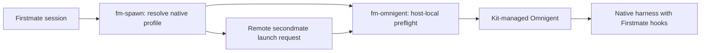

# Omnigent launch boundary

Firstmate selects and supervises the native harness; Omnigent owns the traced native session.
[Configuration](configuration.md#omnigent-launch-mode-configomnigent--fm_omnigent) owns enablement, setup, and supported limits.

`bin/fm-spawn.sh` resolves mode before endpoint creation and preserves the dispatched harness, model, and effort.
The launch template substitutes the Omnigent boundary for the native executable.
Native permission flags, prompts, busy hooks, and turn-end wiring retain their existing owners.
Quota dispatch continues to use the native harness identity.

`bin/fm-omnigent.sh` queries the local Kit status for every preflight and again when the pane executes its launch.
The status file identifies the managed runtime; a separate Omnigent executable on `PATH` can be stale.
The launcher checks the native `--env` capability and server health before invoking that runtime.
A failure never executes the original native command as a fallback.

The service starts native terminals in a different process tree.
Shell inheritance into the CLI alone does not reach those terminals.
The launcher therefore sends the Firstmate-owned environment through Omnigent's explicit native `--env` interface, including secondmate home isolation and the inherited session mode.
It clears foreign harness markers and absent Firstmate routing variables, and leaves Omnigent's managed Codex home intact.
The launcher does not copy arbitrary ambient credentials.

Remote launch and recovery retain the existing SSH control boundary.
The parent sends a mode, and the destination resolves its own Kit service.
The remote endpoint reports its actual mode to the parent, alongside its native profile.
A recorded wrapped task remains wrapped through recovery.

`bin/fm-agent-process-lib.sh` recognizes the observed Python interpreter, Omnigent entrypoint, and native subcommand in order.
A Python process merely mentioning Omnigent, or running its server, is not an agent.
The native harness remains the identity used by steering, interrupt, and exit.
A live wrapper alone does not prove that a model turn completed or that MLflow received its trace.
[Verification](verification/omnigent.md) separates those claims.
